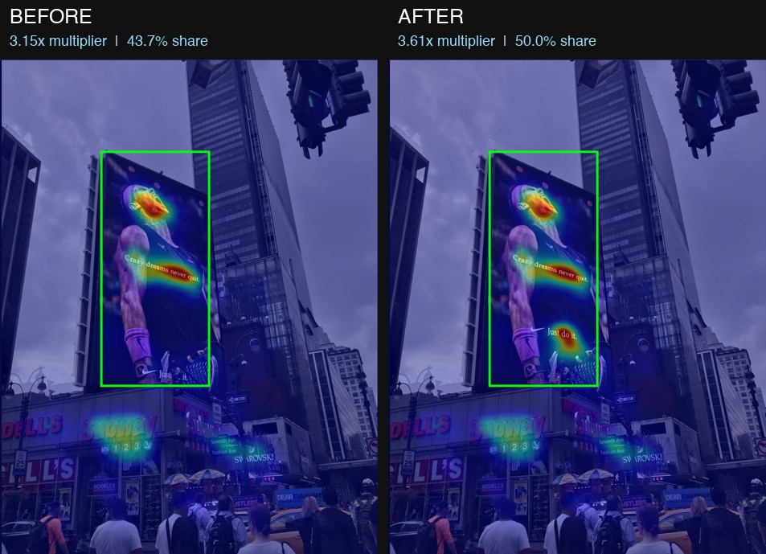
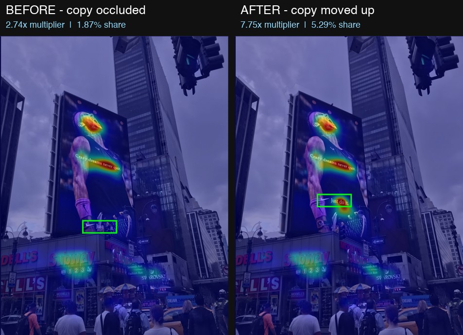

# AdGaze

Predict where people look in an advertisement, score a specific element, and
compare two versions of a creative side by side.

AdGaze wraps the [DeepGaze IIE](https://github.com/matthias-k/DeepGaze) saliency
model in a FastAPI backend and a Streamlit frontend. You upload a photo of an ad,
draw a box around the element you care about (a logo, a headline, a call to
action), and get back a heatmap overlay plus two numbers describing how much
visual attention that element captures.

---

## What it found on a real ad

Below is a Times Square photo of a Nike billboard, before and after moving the
"Just do it." copy up by 128 pixels so it clears the traffic light obstructing it.
Both panels use the `jet` overlay style, and the green box is the scored region —
the same box on both images, since the billboard itself didn't move.



**The billboard as a whole:**

| | Attention Multiplier | Attention Share |
|---|---|---|
| **Before** — copy behind the traffic light | 3.15x | 43.7% |
| **After** — copy moved up, unobstructed | **3.61x** | **50.0%** |
| Change | **+14.6%** | **+6.36 points** |

One edit took the billboard from capturing 43.7% of all the attention in the
street scene to **50.0%** — it now owns half the frame. Look closely at the AFTER
panel and you can see a new warm hotspot appear on the relocated copy, inside the
billboard, where BEFORE there was none.

### Where the gain came from

Scoring a tight box on the copy itself — following it to its new position, keeping
the box size identical — shows the mechanism:



| | Attention Multiplier | Attention Share |
|---|---|---|
| **Before** — occluded | 2.74x | 1.87% |
| **After** — clear | **7.75x** | **5.29%** |
| Change | **+183%** | **+3.42 points** |

In BEFORE the box sits in cold blue: the model predicts almost nobody reads the
copy. In AFTER it lands inside the warm band across the athlete's torso.

### Why the gain is real, and not just "higher on the image"

Saliency models carry a strong **center bias** — anything moved toward the middle
of a frame tends to score better for reasons unrelated to design. To rule that
out, each location was also scored with the text *absent*, which measures what the
real estate is worth on its own:

| Measurement | Attention Multiplier |
|---|---|
| Old spot, text present (occluded) | 2.74 |
| Old spot, text removed (just the obstruction) | 2.87 |
| New spot, text absent (plain jersey) | 1.17 |
| New spot, text present | 7.75 |

Reading those rows:

- The text contributed **−0.13** at the old position and **+6.58** at the new one.
  Where it was occluded, the copy added *nothing* — the 2.87 baseline is the
  traffic light and tennis racket being visually busy on their own. All the
  attention that region earned was going to the obstruction, not to the message.
- The new location is **worse** raw real estate (1.17 vs 2.87). The entire gain
  comes from the copy becoming visible, not from moving toward the center, so the
  center-bias objection doesn't apply.
- JPEG re-encoding noise between the two files was measured at +0.0104 and −0.0259
  on the two boxes — roughly 0.5% of the effect size, so the +5.01 swing is real.

The practical takeaway: AdGaze caught an **occlusion** problem, the kind of thing
that's invisible in a flat mockup and only shows up once the ad is photographed in
its real environment.

---

## The two metrics

Let $D(p)$ be the predicted fixation density at pixel $p$ — the exponentiated
log-density the model outputs. $B$ is the set of pixels inside your box, $I$ is
every pixel in the image, and $|B|$, $|I|$ are their pixel counts.

### Attention Multiplier

How attention-grabbing the region is **per pixel**, relative to an average pixel
of the same image.

$$
\text{Multiplier}(B) = \frac{\dfrac{1}{|B|}\sum_{p \in B} D(p)}{\dfrac{1}{|I|}\sum_{p \in I} D(p)}
$$

In plain terms, it's the mean density inside the box divided by the mean density
of the whole image.

- `1.0x` — exactly average
- `> 1.0x` — a hotspot; `5.4x` means each pixel draws 5.4 times the attention of an average pixel
- `< 1.0x` — a dead zone
- The whole image as a box always scores exactly `1.0x`, by construction
- **Area-normalized**, so box size doesn't inflate it — which is what makes it
  comparable between a small logo and a large headline

### Attention Share

What fraction of **all** the attention in the image lands inside the region.

$$
\text{Share}(B) = \frac{\sum_{p \in B} D(p)}{\sum_{p \in I} D(p)}
$$

- Ranges from 0 to 1 (reported as a percentage)
- `1 − Share` is the attention going to everything else — the "noise" or distraction share
- **Not** area-normalized: a bigger box captures a bigger share automatically

### Why you need both

They answer different questions, and they can disagree in a way that's
informative. A small, vivid sign can be an intense hotspot per pixel while
capturing very little of the total attention, because there isn't much of it. In
the test photo, the Subway storefront sign scores a *higher* multiplier than the
athlete's face (5.96x vs 5.39x) but far less share (6.85% vs 16.15%) — it's
hyper-efficient per pixel, but too small to own the frame.

Read them together:

| Multiplier | Share | Interpretation |
|---|---|---|
| High | High | Dominant focal point |
| High | Low | Eye-catching but too small to matter much |
| Low | High | Large but bland — it earns attention by size alone |
| Low | Low | Effectively invisible |

### A useful identity

Dividing one by the other cancels the pixel counts and leaves the fraction of the
image your box covers:

$$
\frac{\text{Share}(B)}{\text{Multiplier}(B)} = \frac{|B|}{|I|}
$$

This is a handy sanity check. During development it exposed a bug: two images that
looked like a valid before/after pair produced area fractions of 17.1% and 6.5%
for the same pixel box, proving one file had ~2.6x more pixels than the other and
the comparison was invalid.

### Are these standard terms?

Partly. **Attention Share** closely matches *share of attention*, a real term in
eye-tracking and attention measurement. **Attention Multiplier** is this project's
own name — there's no standard metric called that. Note that the established
academic saliency metrics (AUC, NSS, CC, KL divergence) measure something
different: how well a model predicts human eye-tracking ground truth. These two
metrics instead summarize a *predicted* density map over a region, which is what
you want for comparing creatives.

---

## Setup

Requires Python 3.13 and roughly 3 GB of disk for PyTorch and the model weights.
Runs on CPU — no GPU needed.

**1. Clone and create a virtualenv**

```bash
git clone https://github.com/omkota05/AdGaze.git
cd AdGaze
python -m venv venv
source venv/bin/activate
```

**2. Install dependencies**

```bash
pip install -r requirements.txt
```

**3. Install DeepGaze separately**

`deepgaze_pytorch` isn't on PyPI, so it isn't in `requirements.txt`. Clone it
alongside the project and install in editable mode (the `DeepGaze/` directory is
gitignored):

```bash
git clone https://github.com/matthias-k/DeepGaze.git
cd DeepGaze
pip install -e .
cd ..
```

**4. Run the backend**

```bash
venv/bin/uvicorn backend.main:app --reload
```

The first start takes about **60 seconds** while the DeepGaze IIE weights load,
and downloads `centerbias_mit1003.npy` (8 MB) automatically if it's missing. Wait
for `Application startup complete`, then check
[http://127.0.0.1:8000/health](http://127.0.0.1:8000/health) and the interactive
docs at [http://127.0.0.1:8000/docs](http://127.0.0.1:8000/docs).

**5. Run the frontend in a second terminal**

```bash
venv/bin/streamlit run frontend/app.py
```

Opens at [http://localhost:8501](http://localhost:8501). Both processes need to be
running at once — the Streamlit app talks to the FastAPI server over HTTP.

---

## Using the web app

1. Upload an image under **Image A**. Optionally upload a second one under
   **Image B** to compare two versions.
2. Pick an overlay style: `glow` (dark, with only the hottest regions glowing
   red-orange) or `jet` (classic full rainbow gradient).
3. Draw a box around the element you want to score. It's optional — skip it to
   get just the heatmap.
4. Click **Analyze**.

With two images, the metrics under Image B show deltas against Image A, and the
**"Score the same box on both images"** checkbox (on by default) reuses A's
coordinates for B and previews them as a read-only box on B.

Keep that box shared when the element stays put and the design around it changes.
Uncheck it when the element itself moved — as in the demo above — so you can
follow it, and keep the two boxes the same size so area can't skew the result.

---

## API

### `POST /predict`

Multipart upload. Returns JSON.

| Parameter | Type | Notes |
|---|---|---|
| `image` | file | Required. jpg or png |
| `x0`, `y0`, `x1`, `y1` | form ints | Optional. All four or none |
| `style` | query | `jet` (default) or `glow` |

```bash
curl -X POST "http://127.0.0.1:8000/predict?style=glow" \
  -F "image=@test_images/test_image.jpg" \
  -F x0=320 -F y0=340 -F x1=540 -F y1=560
```

```json
{
  "overlay_png_base64": "iVBORw0KGgoAAAANSUhEUgAA...",
  "attention_multiplier": 5.393543574940448,
  "attention_share": 0.16145457645190997
}
```

With no box, both metrics come back `null` and you still get the overlay.
Supplying only some coordinates returns a 400 rather than silently skipping the
metrics.

### `POST /overlay`

Same inputs minus the box, but returns the **raw PNG bytes**
(`content-type: image/png`) instead of base64 — so it renders directly in a
browser with no decoding step.

```bash
curl -X POST "http://127.0.0.1:8000/overlay?style=glow" \
  -F "image=@test_images/test_image.jpg" -o overlay.png
```

### `GET /health`

Returns `{"status": "ok"}` once the model has finished loading.

### Performance note

The model output is cached per image, keyed by a SHA-256 hash of the uploaded
bytes (last 8 images, ~6 MB each). Scoring an image for the first time takes about
**5.7 seconds**; re-scoring the *same* image with a different box takes about
**0.17 seconds**, since only the region arithmetic re-runs. That makes iterating
on box placement practical.

---

## Command-line tools

**Score one image and view the overlay:**

```bash
venv/bin/python test_predict.py                                    # defaults
venv/bin/python test_predict.py test_images/test_image.jpg 320 340 540 560 --style glow
```

Prints both metrics, saves `overlay_output_<style>.png`, and opens it in your
default viewer (`--no-open` skips that). Requires the server to be running, and
tells you so clearly if it isn't.

**Generate before/after test pairs:**

```bash
venv/bin/python make_pairs.py
```

Writes `control.png`, `cta_boosted.png` and `cta_muted.png` into
`test_images_compare/`: an untouched copy plus versions with the call-to-action
recolored to be more and less vivid. The script verifies its own output and fails
if any pixel outside the target box changed.

---

## Tests

```bash
venv/bin/python -m pytest              # 31 fast unit tests, ~2s
venv/bin/python -m pytest -m slow      # 3 real-model regression tests, ~9s warm
```

The fast suite covers box clipping and rescaling, tensor/array coercion, both
metric formulas against hand-computed values, the Share/Multiplier area identity,
and both overlay styles — including a check that the glow style never leaks blue
or green from a colormap. The slow suite loads DeepGaze and pins the exact metric
values for three known regions, so a refactor that changes the math fails loudly.

---

## Project structure

```
backend/
  main.py      FastAPI app, endpoints, density cache
  model.py     SaliencyModel wrapper around DeepGaze IIE + center bias
  metrics.py   compute_attention_multiplier, compute_attention_share
  heatmap.py   make_overlay (jet), make_glow_overlay (red glow)
  arrays.py    array coercion and box clipping helpers
frontend/
  app.py       Streamlit UI: upload, box drawing, comparison
tests/         pytest suite
test_images/   sample photos
docs/          README assets
make_pairs.py  generates before/after pairs
test_predict.py  CLI smoke test for /predict
```

---

## Methodology notes

Things that will silently invalidate a comparison, learned the hard way:

- **Match dimensions exactly.** Different pixel sizes mean the same box covers a
  different share of each image, *and* DeepGaze's output shifts with input
  resolution. The app warns you when two uploads differ in size.
- **Avoid comparing different crops.** A crop changes total area, both metric
  denominators, and the center-bias prior all at once.
- **Prefer lossless edits.** Re-encoding as JPEG perturbs the saliency map
  everywhere. `make_pairs.py` writes PNGs for this reason. (Measured impact is
  small — about 0.01–0.03 on the multiplier — but it's free to avoid.)
- **Change one variable at a time**, ideally by editing programmatically rather
  than by hand, so the edit is reproducible and confined.
- **Run a control pair.** Scoring the same image twice must give a delta of
  exactly zero. If it doesn't, something is wrong in the pipeline.
- **Be skeptical of repositioning results** unless you also measure each
  location's baseline with the element absent, as in the demo above. Otherwise you
  can't separate the element's contribution from the center bias.
- **Box tightly.** A box covering 17% of a street photo measures the whole
  billboard, not the headline inside it.

---

## Reference values

For `test_images/test_image.jpg` (1112×1454), useful for verifying a fresh setup:

| Region | Box (x0, y0, x1, y1) | Multiplier | Share |
|---|---|---|---|
| Whole billboard | 295, 268, 618, 962 | 3.15x | 43.68% |
| Athlete's face | 320, 340, 540, 560 | 5.39x | 16.15% |
| Subway storefront sign | 160, 1040, 470, 1100 | 5.96x | 6.85% |
| "Just do it." (occluded) | 400, 895, 570, 960 | 2.74x | 1.87% |
| Empty sky | 60, 60, 280, 280 | 0.02x | 0.05% |
